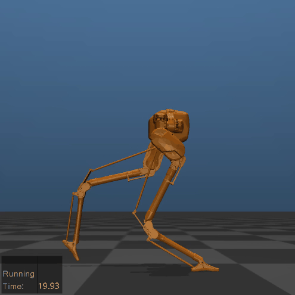

# RoMoCo


<div style="display: flex; justify-content: center; gap: 20px;">


</div>

<div style="display: flex; justify-content: center; gap: 20px;">



</div>


**RoMoCo** (Reduced-order Modeling and Control) is an C++ framework for for simulation and control of bipedal and humanoid robots. 
It provides modular components for planning, control, and simulation interfaces, with the goal of offering a unified, extensible framework for research and development.


## Features
- Modular design for walking, standing, and in-air robot control
- Pinocchio-based kinematics and dynamics
- Integration with MuJoCo for simulation
- Support for state-of-art reduced-order model planners (HLIP, DCM, future ALIP/MLIP)
- Multiple whole-body control methods: TSCQP, position IK, velocity IK, inverse dynamics, future hierarchical QP
- Easy-to-extend base classes for new robots or controllers

## Overview
- biped_core: Core functionalities: robot kinematics, dynamics, and base classes.
- biped_planner: Reduced-order model planners
- biped_control: Output generation and embedding for whole-body control
- mujoco_interface: Interface for MuJoCo simulation
- torque_control: Different whole-body torque control methods
- biped_state_machine: Example state machine for bipedal locomotion
- biped_utils: Utility functions: Bezier, Yaml parsing, geometry, etc.
  
Robots: G1, Cassie, H1, more to come  

## Build & Run
Tested with ROS2 Humble and Ubuntu 22.04. 

### Run from Docker
```
./docker/build.sh
./docker/run.sh
```

```
colcon build --symlink-install --cmake-args -DCMAKE_BUILD_TYPE=Release
. install/setup.bash
```


### Build
Install the dependencies listed below then clone the repository and build it using `colcon build`.

### Run Tests
To run tests, `colcon test`

### Launch
Source the workspace `source devel/setup.bash` and run the example launch files in g1_simulation, cassie_simulation, or h1_simulation (no tuning, walking is very rough) packages. The controllers included are not extensively tuned, but they should work for basic walking.

`roslaunch g1_simulation g1mujoco.launch ` starts simulation and switches from stand to walk at a predefined time.
`roslaunch cassie_simulation cassiemujoco.launch` includes a fake radio; toggle SB from 0 to 1 for stand-to-walk transition. 

## License
This project is licensed under the GNU General Public License v3.0. See the [LICENSE](LICENSE) file for details.
## Installation
```
sudo apt-get update
sudo apt-get install -y build-essential vim gcc  g++  gfortran git patch wget  cmake  pip liblapack-dev  libmetis-dev  libblas-dev  libatlas-base-dev libglpk-dev pkg-config ipython3 python3-dev python3-catkin-tools python3-tk swig doxygen doxygen-latex liburdfdom-dev libassimp-dev ros-noetic-eigenpy libboost-all-dev libglfw3 libglfw3-dev qtcreator qtbase5-dev --install-recommends
python3 -m pip install --upgrade numpy 
echo 'export PATH=$HOME/.local/bin:$PATH' >> ~/.bashrc
source ~/.bashrc
```


Pinocchio, optional `-DBUILD_WITH_CASADI_SUPPORT=ON `
```
cd ~/repos/
git clone --recursive https://github.com/stack-of-tasks/pinocchio
git checkout v3.3.1
cd pinocchio && mkdir build && cd build
cmake .. -DCMAKE_BUILD_TYPE=Release -DCMAKE_INSTALL_PREFIX=/usr/local -DPYTHON_EXECUTABLE=/usr/bin/python3 -DBUILD_WITH_COLLISION_SUPPORT=ON 
make -j4
sudo make install
```
In `.bashrc`, add the following to it with correct python version
```
export PATH=/usr/local/bin:$PATH
export PKG_CONFIG_PATH=/usr/local/lib/pkgconfig:$PKG_CONFIG_PATH
export LD_LIBRARY_PATH=/usr/local/lib:$LD_LIBRARY_PATH
export PYTHONPATH=/usr/local/lib/python3.8/site-packages:$PYTHONPATH
export CMAKE_PREFIX_PATH=/usr/local:$CMAKE_PREFIX_PATH
```


Eigen 3.4.0
```
cd ~/repos/
git clone https://gitlab.com/libeigen/eigen.git 
cd eigen 
git checkout 3147391d 
mkdir build 
cd build 
cmake .. 
sudo make install
```

Mujoco
```
cd ~/repos/
wget https://github.com/google-deepmind/mujoco/releases/download/3.2.6/mujoco-3.2.6-linux-x86_64.tar.gz
tar -xvzf mujoco-3.2.6-linux-x86_64.tar.gz
rm mujoco-3.2.6-linux-x86_64.tar.gz 
```

QP
```
curl --proto '=https' --tlsv1.2 -sSf https://sh.rustup.rs | sh
echo 'export PATH="$HOME/.cargo/bin:$PATH"' >> ~/.bashrc
source ~/.bashrc
cd ~/repos/
git clone --recurse-submodules https://github.com/oxfordcontrol/Clarabel.cpp.git
cd Clarabel.cpp 
mkdir build 
cd build 
cmake  -DCMAKE_BUILD_TYPE=Release .. 
cmake --build .  
```

For debugging:
```
cd ~/repos/
git clone https://github.com/dmillard/eigengdb
cd eigengdb
sudo python3 setup.py install 
python3 bin/eigengdb_register_printers
```


## Todo:
- [ ] hierarchical QP controller for humanoids (WIP)
- [ ] Add multi-domain planner MLIP and embedding (need integration)
- [ ] kalman filter used for Cassie (need integration)
- [ ] Docker cleanup + verify

